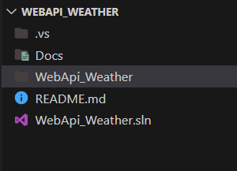
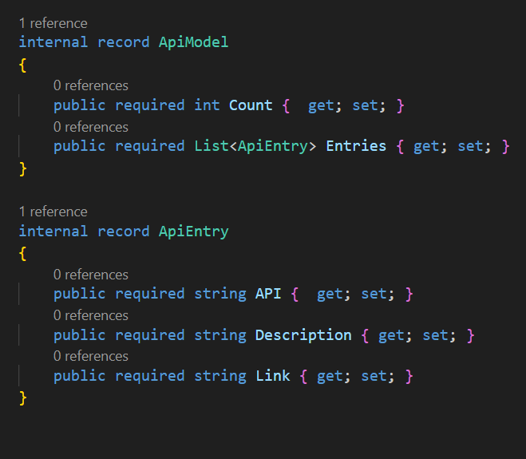
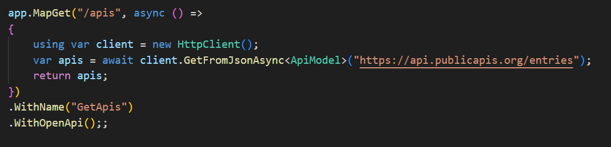
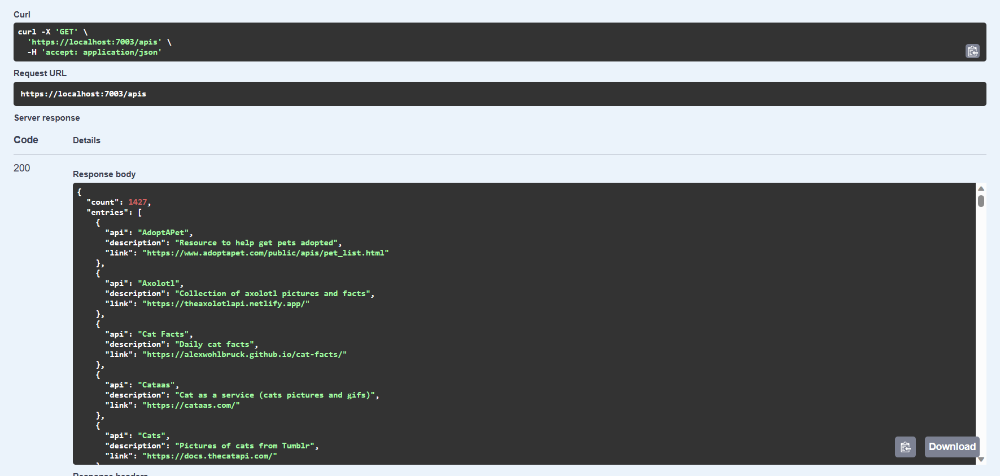

# Informe APIS

Link del github: https://github.com/CodeINN95612/Integraciones_API

## Instrucciones

Cree una aplicación que permita:

- Consumir un API Pública
- Publicar un API para que una aplicación externa la pueda consumir
- Trabajo en grupo, lo debe subir el líder del grupo y los otros miembros subir un archivo indicando quién subió el informe completo.

El informe debe incluir los pasos del trabajo realizado, conclusiones y recomendaciones. También debe incluir el enlace a Github del proyecto realizado.

## Desarrollo

1. Crear una api web en .net con **Minimal APIS**
   
2. Buscar una api publica que se pueda consumir, en este caso usaremos la api de apis.
3. Generar los modelos de la api publica
   
4. Generar un nuevo endpoint de Minimal Api de tipo **GET**
   
5. Consumir la api
   

## Conclusiones

1. **Importancia de la Colaboración en Grupo**: Durante el desarrollo del proyecto, se evidenció la importancia de la colaboración en grupo. El trabajo conjunto permitió aprovechar las habilidades y conocimientos diversos de cada miembro, mejorando la eficiencia y la calidad del producto final.
2. **Experiencia Práctica en Consumo y Publicación de APIs**: El proyecto brindó una valiosa experiencia práctica en la integración de APIs, tanto consumiendo una API pública como publicando una propia. Esto fortaleció la comprensión de los procesos y desafíos asociados con la interconexión de sistemas.
3. **Desafíos en la Documentación y Comunicación**: Se identificó la importancia crítica de la documentación clara y la comunicación efectiva, por suerte .NET tiene configurada la herramienta de **SWAGGER**.

## Recomendaciones

1. **Implementar Pruebas Exhaustivas**: Se recomienda implementar pruebas exhaustivas tanto en el consumo como en la publicación de APIs. Las pruebas contribuyen a la estabilidad del sistema, aseguran un comportamiento esperado y facilitan la detección temprana de posibles problemas, mejorando la calidad del software.
1. **Explorar Herramientas de Gesti�n de Proyectos**: Considerando la naturaleza del trabajo en grupo, se sugiere explorar y adoptar herramientas de gestión de proyectos. Plataformas como Trello, Asana o GitHub Projects pueden mejorar la organización, asignación de tareas y seguimiento del progreso, facilitando la colaboración efectiva.
1. **Priorizar la Seguridad de la API**: Es fundamental priorizar la seguridad al publicar APIs. Se recomienda implementar medidas como autenticación segura, control de acceso adecuado y cifrado de datos para proteger la integridad y confidencialidad de la información transmitida. La seguridad debe ser una consideración constante en el desarrollo y mantenimiento del sistema.
